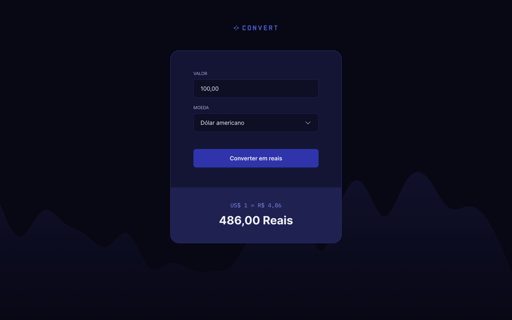

# Convert App

A simple and responsive web application for converting foreign currencies to Brazilian Reais using JavaScript, HTML, and CSS.

## Access

You can open the project locally by opening `index.html` in your browser.

## Features

- Convert predefined currencies (e.g., USD) to BRL.
- Input validation and formatting.
- Dark theme with modern UI.

## Technologies

- HTML5
- CSS3
- JavaScript (Vanilla)

## Project Structure

```
convert/
│
├── index.html          # Main HTML file
├── styles.css          # Stylesheet
├── script.js           # JavaScript logic
└── img/                # Image assets
```

## How to Use

1. Clone the repository:

   ```bash
   git clone https://github.com/your-username/convert.git
   cd convert
   ```

2. Open `index.html` in your browser.

No backend or external dependencies required.

## Preview



## Author

Lucas Homero  
GitHub: [https://github.com/lucashomero](https://github.com/lucashomero)
